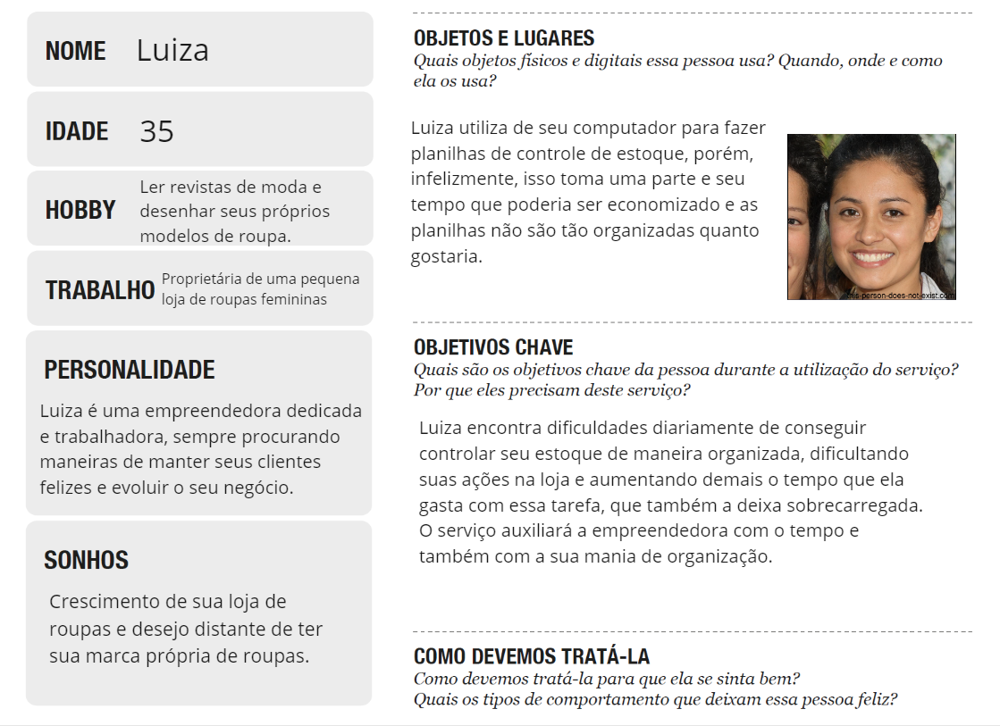
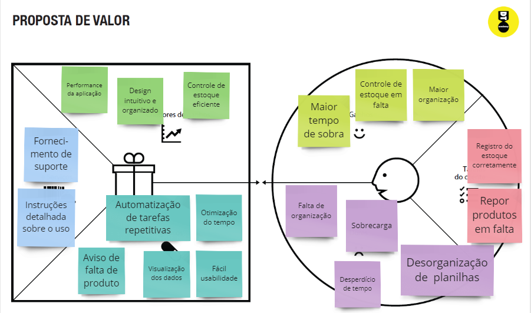
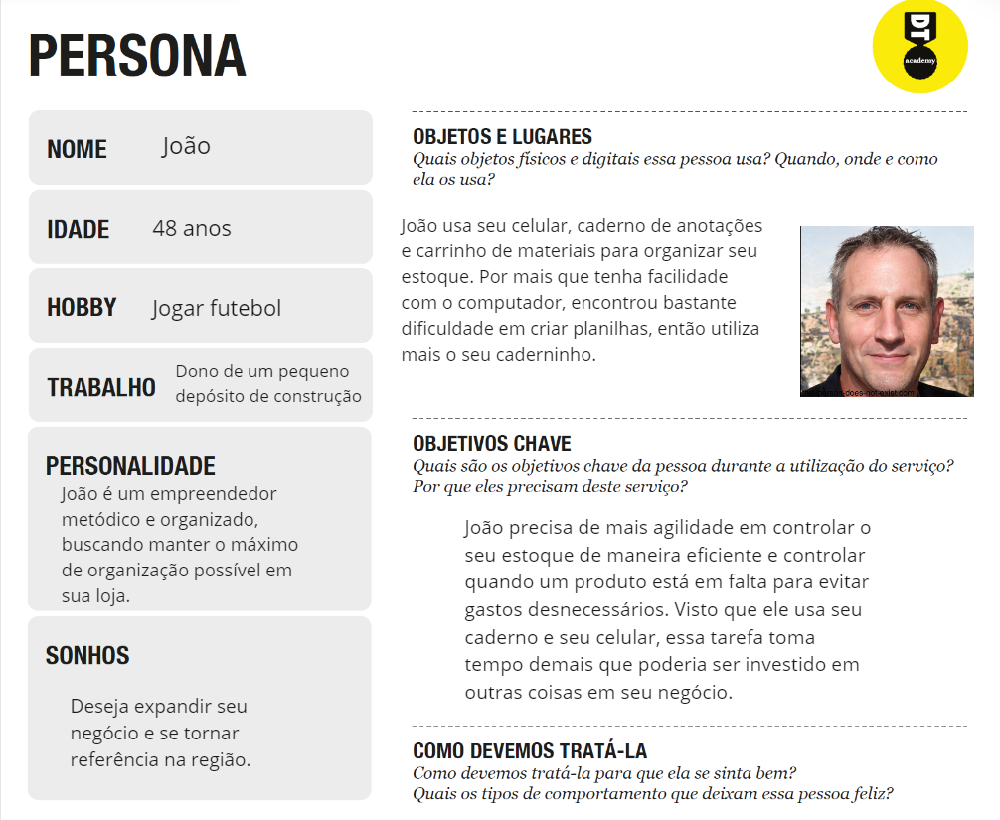
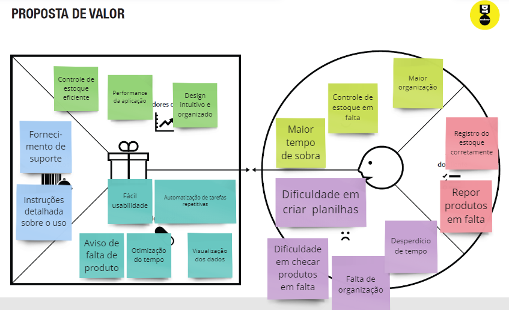
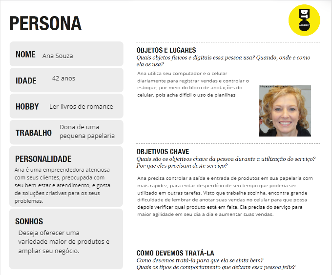
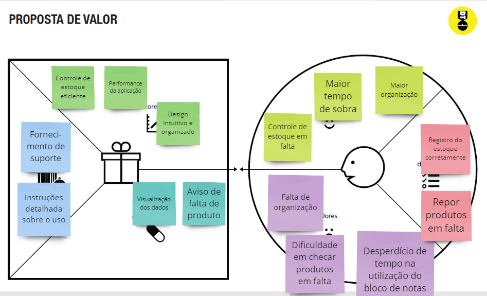

# Informações do Projeto
`TÍTULO DO PROJETO`  

EstoqueMaster

`CURSO` 

Ciência da Computação - PUC Minas COREU

## Participantes
Túlio Gomes Braga
Gabriel Glatz Campos
Ricardo Soares Pereira da Gama Cerqueira
Iago de Lara Cotta Ponteio
Julia Roque Pinheiro
# Estrutura do Documento

- [Informações do Projeto](#informações-do-projeto)
  - [Participantes](#participantes)
- [Estrutura do Documento](#estrutura-do-documento)
- [Introdução](#introdução)
  - [Problema](#problema)
  - [Objetivos](#objetivos)
  - [Justificativa](#justificativa)
  - [Público-Alvo](#público-alvo)
- [Especificações do Projeto](#especificações-do-projeto)
  - [Personas, Empatia e Proposta de Valor](#personas-empatia-e-proposta-de-valor)
  - [Histórias de Usuários](#histórias-de-usuários)
  - [Requisitos](#requisitos)
    - [Requisitos Funcionais](#requisitos-funcionais)
    - [Requisitos não Funcionais](#requisitos-não-funcionais)
  - [Restrições](#restrições)
- [Projeto de Interface](#projeto-de-interface)
  - [User Flow](#user-flow)
  - [Wireframes](#wireframes)
- [Metodologia](#metodologia)
  - [Divisão de Papéis](#divisão-de-papéis)
  - [Ferramentas](#ferramentas)
  - [Controle de Versão](#controle-de-versão)
- [**############## SPRINT 1 ACABA AQUI #############**](#-sprint-1-acaba-aqui-)
- [Projeto da Solução](#projeto-da-solução)
  - [Tecnologias Utilizadas](#tecnologias-utilizadas)
  - [Arquitetura da solução](#arquitetura-da-solução)
- [Avaliação da Aplicação](#avaliação-da-aplicação)
  - [Plano de Testes](#plano-de-testes)
  - [Ferramentas de Testes (Opcional)](#ferramentas-de-testes-opcional)
  - [Registros de Testes](#registros-de-testes)
- [Referências](#referências)

# Introdução
Com a evolução constante do mercado, uma organização eficiente se tornou indubitavelmente um dos maiores requisitos para o sucesso de um empreendimento, independente da área. Ter boa gestão pode ser a diferença que fará um cliente escolher um produto em relação ao concorrente. Dessa forma, garantir uma boa estrutura é de suma importância ao gerir um negócio.

Em anos recentes, alcançar estabilidade financeira se tornou um desafio para grande parcela da população. Por isso, muitas pessoas viram oportunidade de renda ao abrir a própria pequena empresa, suprindo as necessidades da sua localidade, vendendo comida, equipamento para diversas atividades, medicamentos, roupas, entre muitos outros. O pequeno negócio alcançou marcas históricas no Brasil em 2021, quando mais de 4 milhões de MEIs (Microempreendedores Individuais) foram registrados, um aumento de mais de 50% se comparado a apenas 3 anos antes, de acordo com um levantamento feito pelo SEBRAE, baseado em dados da Receita Federal. Ademais, grande parte dos novos empreendedores não possuem o devido conhecimento e tempo para instituir as medidas apropriadas e crescer no mercado.

Frente a isso, soluções eficientes para a organização e gerenciamento dos diversos aspectos de um negócio são essenciais para que o empreendedor possa crescer no mercado da melhor maneira possível.

## Problema

Conforme exposto, há grande carência de soluções para a dificuldade de organização, principalmente em pequenas empresas. Dessa forma, esse projeto busca sanar uma grande parte dessa problemática: o estoque, seja em relação ao armazenamento, categorização ou a precificação.

## Objetivos
O objetivo geral deste trabalho é a criação de uma aplicação web que apresenta ferramentas práticas e intuitivas para o gerenciamento do estoque de um empreendimento, a fim de agilizar e melhorar o seu funcionamento.

De modo específico, são notáveis:

Categorização dos produtos em diversos filtros e total liberdade;
Controle de saída e entrada de produtos;
Notificar quando um produto precisa ser reabastecido, para evitar que falte.
Notificar produtos prestes a vencer, para evitar desperdícios.

## Justificativa
De acordo com uma pesquisa do IBGE (Instituto Brasileiro de Geografia e Estatística), 60% das empresas vão à falência nos primeiros 5 anos. Destas, 29% são de MEIs (Microempreendedores Individuais) e 21% são microempresas. Esse grupo é o mais suscetível à falência já que, normalmente, não possuem o conhecimento ou capital adequado para realizar investimentos e gerir de forma eficaz.
## Público-Alvo
Existe uma enorme variedade de empresas que podem se beneficiar de uma boa gestão de estoque. Entretanto, o foco deste trabalho são os donos de pequenos negócios com interesse em crescer no mercado e atender seus clientes da melhor forma possível.

Logo, o público alvo escolhido foram adultos donos de comércios locais, especialmente MEIs e microempresas, que não possuem capital para contratar grande quantidade de funcionários ou serviços responsáveis pela organização ideal de seus produtos.
 
# Especificações do Projeto

A definição exata do problema e os pontos mais relevantes a serem tratados neste projeto foi consolidada com a participação dos usuários em um trabalho de imersão, feito pelos membros da equipe a partir da observação dos usuários em seu local natural e por meio de entrevistas. Os detalhes levantados nesse processo foram consolidados na forma de personas e histórias de usuários.

## Personas, Empatia e Proposta de Valor

**Persona 1:**

**Persona 2:**

**Persona 3:**

## Histórias de Usuários

Com base na análise das personas forma identificadas as seguintes histórias de usuários:

|EU COMO... `PERSONA`| QUERO/PRECISO ... `FUNCIONALIDADE` |PARA ... `MOTIVO/VALOR`                 |
|--------------------|------------------------------------|----------------------------------------|
|Luiza Matos         | Visualizar com maior organização os produtos de sua loja       | Poder entender melhor o que tem/está em falta em sua loja|
|Luiza Matos         | Visualizar uma pequena imagem do item| Controle de quais roupas ela está visualizando, pois não consegue lembrar todas por nome |
|Luiza Matos         | Organizar itens por meio de preço | Verificar quais itens de roupa irão lhe custar mais na hora dos pedidos |
|João Gomes | Poder selecionar um estoque mínimo para cada item | Poder ver quando um produto está chegando ao fim |
|João Gomes | Poder visualizar de forma filtrada seus itens, seja por categorias ou outras condições | Maior organização e entendimento de seus itens |
|João Gomes | Visualizar quanto os produtos irão lhe custar | Organização financeira na hora dos pedidos |
|Ana Souza | Poder usar o web app tanto no computador quanto no celular | Possui maior facilidade com o uso de celular |
|Ana Souza | Selecionar mais de um item ao mesmo tempo para fazer edições/excluí-los | Otimização de seu tempo na hora da edição de preços e itens |
|Ana Souza | Poder entender intuitivamente a função dos componentes do site, e poder visualizar de maneira fácil seus itens | Possui dificuldade com a utilização do computador |

## Requisitos

As tabelas que se seguem apresentam os requisitos funcionais e não funcionais que detalham o escopo do projeto.

### Requisitos Funcionais

|ID    | Descrição do Requisito  | Prioridade |
|------|-----------------------------------------|----|
|RF-001| O site deve apresentar uma visualização de todos os itens em estoque, assim como sua quantidade disponível | ALTA | 
|RF-002| O site deve apresentar uma landing page que explique o produto ao usuário.   | BAIXA |
|RF-003| O site deve apresentar separação por categorias e nobreza do produto. | MÉDIA |
|RF-004| O site deve apresentar a possibilidade de adicionar, excluir e editar produtos. | ALTA |
|RF-005| O site deve avisar quando um produto está chegando perto de seu estoque mínimo ou já o atingiu. | ALTA |
|RF-006| O site deve produzir um relatório, quando solicitado, de todos os produtos em falta. | MÉDIA |
|RF-007| O site deve apresentar a possibilidade de selecionar mais de um produto. | BAIXA |
|RF-008| Deve ser exibido, junto ao item, uma imagem do mesmo. | BAIXA-MÉDIA |
|RF-009| O site deve disponibilizar o contato para suporte caso necessário. | BAIXA |
|RF-010| O site deve apresentar filtros de pesquisa para permitir que o usuário faça pesquisas específicas. | MÉDIA |

### Requisitos não Funcionais

|ID     | Descrição do Requisito  |Prioridade |
|-------|-------------------------|----|
|RNF-001| O site deve ser publicado em um ambiente acessível publicamente na Internet (Repl.it, GitHub Pages, Heroku) | ALTA | 
|RNF-002| O site deverá ser responsivo permitindo a visualização em um celular de forma adequada | ALTA | 
|RNF-003| O site deve ter bom nível de contraste entre os elementos da tela em conformidade | MÉDIA |
|RNF-004| O site deve apresentar uma interface amigável e intuitiva, com fácil usabilidade. | ALTA |
|RNF-005| O site deve ser compatível com os principais navegadores do mercado (Google Chrome, Firefox, Microsoft Edge) | ALTA |
|RNF-006| O sistema deve apresentar segurança em relação às informações do usuário. | ALTA |
|RNF-007| O site deve apresentar uma documentação com instruções de uso. | ALTA |
|RNF-008| O site deve apresentar uma boa performance quando lidando com um alto número de itens. | MÉDIA |
|RNF-009| O site deve ser feito para que a manutenção dele seja fácil. | MÉDIA |
|RNF-010| O site deve apresentar boa confiabilidade. | BAIXA |

## Restrições

O projeto está restrito pelos itens apresentados na tabela a seguir.

|ID| Restrição                                             |
|--|-------------------------------------------------------|
|01| O projeto deverá ser entregue no final do semestre letivo, não podendo extrapolar a data de 07/07/2020. |
|02| O aplicativo deve se restringir às tecnologias básicas da Web no Frontend      |
|03| A equipe não pode subcontratar o desenvolvimento do trabalho. |

# Projeto de Interface

......  COLOQUE AQUI O SEU TEXTO DE INTRODUÇÃO ......

> Apresente as principais interfaces da solução. Discuta como 
> foram elaboradas de forma a atender os requisitos funcionais, não
> funcionais e histórias de usuário abordados nas [Especificações do
> Projeto](#especificações-do-projeto).

## User Flow

......  INCLUA AQUI O DIAGRAMA COM O FLUXO DO USUÁRIO NA APLICAÇÃO ......

> Fluxo de usuário (User Flow) é uma técnica que permite ao desenvolvedor
> mapear todo fluxo de telas do site ou app. Essa técnica funciona
> para alinhar os caminhos e as possíveis ações que o usuário pode
> fazer junto com os membros de sua equipe.
>
> **Links Úteis**:
> - [User Flow: O Quê É e Como Fazer?](https://medium.com/7bits/fluxo-de-usu%C3%A1rio-user-flow-o-que-%C3%A9-como-fazer-79d965872534)
> - [User Flow vs Site Maps](http://designr.com.br/sitemap-e-user-flow-quais-as-diferencas-e-quando-usar-cada-um/)
> - [Top 25 User Flow Tools & Templates for Smooth](https://www.mockplus.com/blog/post/user-flow-tools)
>
> **Exemplo**:
> 
> 

## Wireframes

......  INCLUA AQUI OS WIREFRAMES DAS TELAS DA APLICAÇÃO COM UM BREVE DESCRITIVO ......

> Wireframes são protótipos das telas da aplicação usados em design de interface para sugerir a
> estrutura de um site web e seu relacionamentos entre suas
> páginas. Um wireframe web é uma ilustração semelhante ao
> layout de elementos fundamentais na interface.
> 
> **Links Úteis**:
> - [Ferramentas de Wireframes](https://rockcontent.com/blog/wireframes/)
> - [Figma](https://www.figma.com/)
> - [Adobe XD](https://www.adobe.com/br/products/xd.html#scroll)
> - [MarvelApp](https://marvelapp.com/developers/documentation/tutorials/)
> 
> **Exemplo**:
> 
> 

# Metodologia

A metodologia contempla as definições de ferramental utilizado pela equipe tanto para a manutenção dos códigos e demais artefatos quanto para a organização do time na execução das tarefas do projeto.

Para organização e distribuição das tarefas do projeto, a equipe está utilizando o Trello estruturado com as seguintes listas: 

- Recursos: esta lista mantém um template de tarefas recorrentes com as configurações padronizadas que todos devem seguir. O objetivo é permitir a cópia destes templates para agilizar a criação de novos cartões.
- Backlog: recebe as tarefas a serem trabalhadas e representa o Product Backlog. Todas as atividades identificadas no decorrer do projeto também devem ser incorporadas a esta lista.
- To Do: Esta lista representa o Sprint Backlog. Este é o Sprint atual que estamos trabalhando.
- Doing: Quando uma tarefa tiver sido iniciada, ela é movida para cá.
- Test: Checagem de Qualidade. Quando as tarefas são concluídas, eles são movidas para o “CQ”. No final da semana, eu revejo essa lista para garantir que tudo saiu perfeito.
- Done: nesta lista são colocadas as tarefas que passaram pelos testes e controle de qualidade e estão prontos para ser entregues ao usuário. Não há mais edições ou revisões necessárias, ele está agendado e pronto para a ação.
- Locked: Quando alguma coisa impede a conclusão da tarefa, ela é movida para esta lista juntamente com um comentário sobre o que está travando a tarefa.

O quadro kanban do grupo no Trello está disponível através da URL: https://trello.com/invite/b/lN7IbSia/ATTI05844cb363c1e591308c0b9baced13c6EBC0DF03/estoquemaster. A definição desta estrutura se baseou na proposta feita por Littlefield (2016).

## Divisão de Papéis

> Scrum Master: Ricardo Soares Cerqueira
> Project Owner: Gabriel Glatz Campos
> Equipe de Desenvolvimento: 
> - Tulio Gomes Braga
> - Julia Pinheiro Roque
> - Iago de Lara Cotta

## Ferramentas

| Ambiente  | Plataforma              |Link de Acesso |
|-----------|-------------------------|---------------|
| Processo de Design Thinkgin  | Miro | https://miro.com/app/board/uXjVMU67v_I=/  | 
| Repositório de Código Fonte | GitHub | https://github.com/ICEI-PUC-Minas-PMGCC-TI/ti-1-pmg-cc-m-20231-gestao-e-planejamento-de-empresas | 
| Gerenciamento do Projeto | Trello |  https://trello.com/invite/b/lN7IbSia/ATTI05844cb363c1e591308c0b9baced13c6EBC0DF03/estoquemaster | 
| Projeto de Interface e  Wireframes | Figma | https://www.figma.com/file/0FqMENsMKP9dn9WXEysFDt/Wireframe-TIFE?node-id=0-1&t=DKM5zpvKQzNWMRtm-0 | 
| Documentos do Projeto | Google Docs | https://docs.google.com/document/d/1o8hlWhMQB_1fE9EFxd_FxMSgKaL6jVDjgqblsqcioi0/edit?usp=sharing |

## Controle de Versão

Para gestão do código fonte do software desenvolvido pela equipe, o grupo utiliza um processo baseado no Git Feature Branch Workflow, mostrado na Figura a seguir. Desta forma, todas as manutenções no código são realizadas em branches separadas. Uma explicação rápida sobre este processo é apresentada no site "[5 Git Workflows & Branching Strategy to deliver better code](https://zepel.io/blog/5-git-workflows-to-improve-development/)".
> 

# **############## SPRINT 1 ACABA AQUI #############**

# Projeto da Solução

......  COLOQUE AQUI O SEU TEXTO ......

## Tecnologias Utilizadas

......  COLOQUE AQUI O SEU TEXTO ......

> Descreva aqui qual(is) tecnologias você vai usar para resolver o seu
> problema, ou seja, implementar a sua solução. Liste todas as
> tecnologias envolvidas, linguagens a serem utilizadas, serviços web,
> frameworks, bibliotecas, IDEs de desenvolvimento, e ferramentas.
> Apresente também uma figura explicando como as tecnologias estão
> relacionadas ou como uma interação do usuário com o sistema vai ser
> conduzida, por onde ela passa até retornar uma resposta ao usuário.
> 
> Inclua os diagramas de User Flow, esboços criados pelo grupo
> (stoyboards), além dos protótipos de telas (wireframes). Descreva cada
> item textualmente comentando e complementando o que está apresentado
> nas imagens.

## Arquitetura da solução

......  COLOQUE AQUI O SEU TEXTO E O DIAGRAMA DE ARQUITETURA .......

> Inclua um diagrama da solução e descreva os módulos e as tecnologias
> que fazem parte da solução. Discorra sobre o diagrama.
> 
> **Exemplo do diagrama de Arquitetura**:
> 
> 

# Avaliação da Aplicação

......  COLOQUE AQUI O SEU TEXTO ......

> Apresente os cenários de testes utilizados na realização dos testes da
> sua aplicação. Escolha cenários de testes que demonstrem os requisitos
> sendo satisfeitos.

## Plano de Testes

......  COLOQUE AQUI O SEU TEXTO ......

> Enumere quais cenários de testes foram selecionados para teste. Neste
> tópico o grupo deve detalhar quais funcionalidades avaliadas, o grupo
> de usuários que foi escolhido para participar do teste e as
> ferramentas utilizadas.
> 
> **Links Úteis**:
> - [IBM - Criação e Geração de Planos de Teste](https://www.ibm.com/developerworks/br/local/rational/criacao_geracao_planos_testes_software/index.html)
> - [Práticas e Técnicas de Testes Ágeis](http://assiste.serpro.gov.br/serproagil/Apresenta/slides.pdf)
> -  [Teste de Software: Conceitos e tipos de testes](https://blog.onedaytesting.com.br/teste-de-software/)

## Ferramentas de Testes (Opcional)

......  COLOQUE AQUI O SEU TEXTO ......

> Comente sobre as ferramentas de testes utilizadas.
> 
> **Links Úteis**:
> - [Ferramentas de Test para Java Script](https://geekflare.com/javascript-unit-testing/)
> - [UX Tools](https://uxdesign.cc/ux-user-research-and-user-testing-tools-2d339d379dc7)

## Registros de Testes

......  COLOQUE AQUI O SEU TEXTO ......

> Discorra sobre os resultados do teste. Ressaltando pontos fortes e
> fracos identificados na solução. Comente como o grupo pretende atacar
> esses pontos nas próximas iterações. Apresente as falhas detectadas e
> as melhorias geradas a partir dos resultados obtidos nos testes.

# Referências

......  COLOQUE AQUI O SEU TEXTO ......

> Inclua todas as referências (livros, artigos, sites, etc) utilizados
> no desenvolvimento do trabalho.
> 
> **Links Úteis**:
> - [Formato ABNT](https://www.normastecnicas.com/abnt/trabalhos-academicos/referencias/)
> - [Referências Bibliográficas da ABNT](https://comunidade.rockcontent.com/referencia-bibliografica-abnt/)
